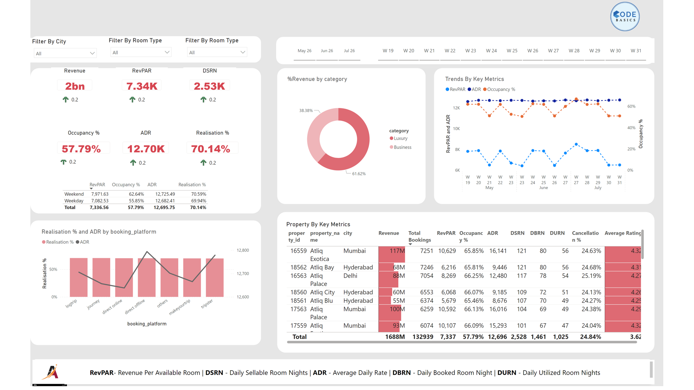

# Business-Intelligence-Power-BI-Hotel-Project
Interactive Power BI dashboard analyzing hotel occupancy, revenue, and booking trends.

## 📌 Project Summary

This project demonstrates an end-to-end Business Intelligence workflow using Microsoft Power BI to analyze hotel booking data and generate actionable performance insights.
The objective was to transform raw operational data into a structured data model and an interactive dashboard that supports hotel management decision-making.

## 🎯 Business Problem

Hotel management teams need visibility into:
1. Revenue performance
2. Occupancy rates
3. Booking trends
4. Room category performance
5. Time-based performance comparisons
Without structured reporting, it becomes difficult to monitor KPIs and make strategic decisions.

## Overview
*Dashboard Overview*

## 🛠️ Solution Approach
1️⃣ Data Preparation (Power Query)
Cleaned and transformed multiple datasets
Standardized column names and data types
Removed inconsistencies and ensured data quality

2️⃣ Data Modeling
Built a star schema model
Created relationships between:
- fact_bookings
- fact_aggregated_bookings
- dim_date
- dim_hotels
- dim_rooms
Ensured proper cardinality and filter flow

3️⃣ DAX & KPI Development
Developed key performance metrics including:
- Total Revenue
- Occupancy Rate
- Average Daily Rate (ADR)
- Booking Volume Trends
- Time-based comparisons

4️⃣ Dashboard Development
Designed an interactive dashboard with KPI cards and trend visuals
Added slicers for dynamic filtering (date, room type, hotel)
Focused on clarity, usability, and executive-level storytelling

5️⃣ Deployment
Published the final report
Exported to PowerPoint
Shared via Google Drive

## 📊 Key Insights Generated
Identified seasonal booking patterns
Compared revenue performance across room categories
Evaluated occupancy trends over time
Highlighted high-performing segments

## ⚠️ Challenges & Learning
Designing an efficient star schema model
Writing DAX measures that behaved correctly under multiple filters
Balancing technical depth with dashboard simplicity
This project strengthened my expertise in:
- Data modeling
- DAX calculations
- Business storytelling with data
- End-to-end BI delivery

## 🧰 Tools & Technologies
Microsoft Power BI
Power Query
DAX
Dimensional Modeling (Star Schema)
